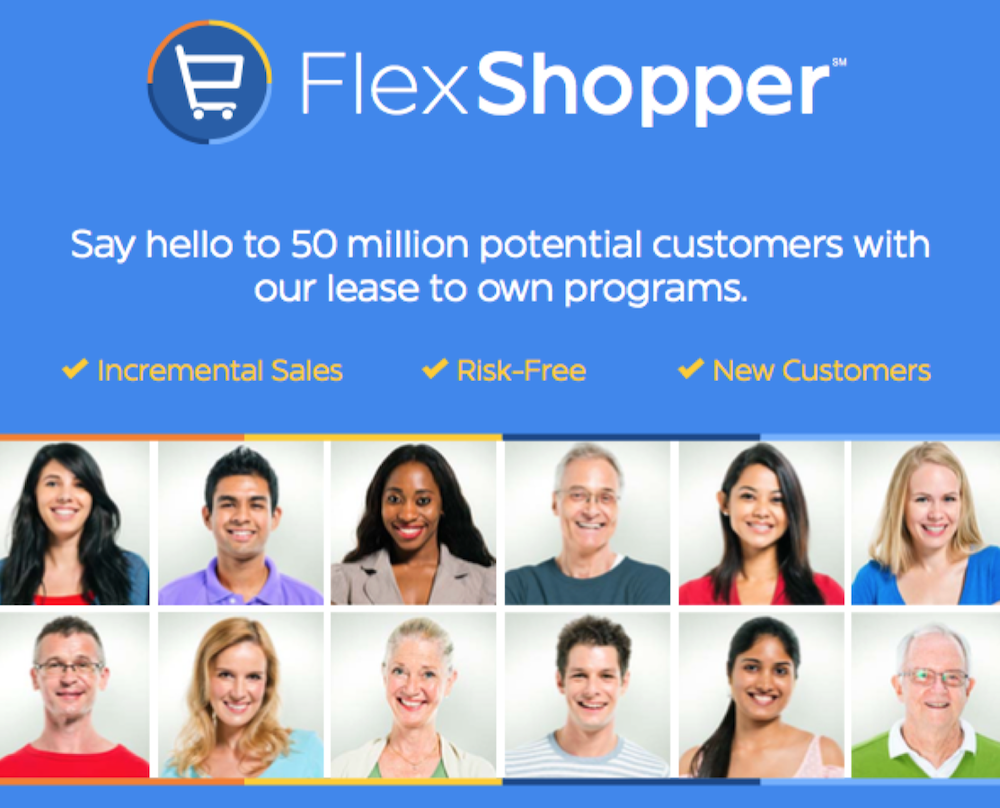
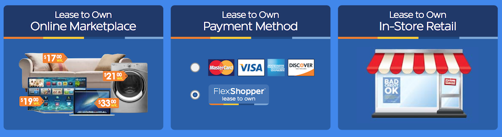

#### Overview
FlexShopper spends millions of dollars in marketing, specifically targeted to 50 million Americans with little to no credit.  **We offer three (3) major integration channels** to tap into this customer base.  And, once you are integrated with FlexShopper we use these channels to drive customers into your stores and website.  We offer the largest Rent-To-Own [Marketplace](https://github.com/FlexShopper/docs/blob/master/marketplace.md) online, where your products can be featured and sold with our marketing dollars.  We use the Marketplace as a vehicle to drive consumers to your website, where they can shop and pay at checkout with our [Payment Method](https://github.com/FlexShopper/docs/blob/master/payment-method.md).  Finally after shopping on your website if a customer decides they want to walk into a store to see your products they can use our [In Store Kiosk](url) to checkout.  [Read More](https://github.com/FlexShopper/docs/blob/master/assets/FlexShopper-Overview.pdf)

## Start Here
1. Signup for a [Merchant Account](https://github.com/FlexShopper/docs/blob/master/merchant-account.md)
2. Choose an Integration Channel
	- [ ]  [API Documentation] 
	[Marketplace](https://github.com/FlexShopper/docs/blob/master/marketplace.md)&nbsp;&nbsp;&nbsp;&nbsp;&nbsp;&nbsp;&nbsp;&nbsp;&nbsp;&nbsp;&nbsp;&nbsp;[Payment Method](https://github.com/FlexShopper/docs/blob/master/payment-method.md) &nbsp;&nbsp;&nbsp;&nbsp;&nbsp;&nbsp;&nbsp;&nbsp;&nbsp;&nbsp;&nbsp;&nbsp;[In Store Kiosk](flex-kiosk.md)

3. Contact us with any questions
	- `integration @ flexshopper.com`
4. Receive new customers and _enjoy_!

> The best way to begin is to submit a Merchant Application. Once approved you can begin processing orders immediately!

